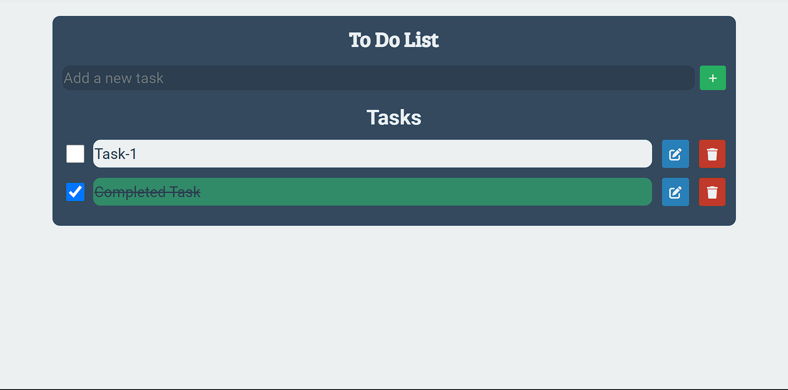

To-Do List App

Overview
The To-Do List App is a simple web application that allows users to manage their tasks efficiently. Users can add, edit, delete, and mark tasks as completed. The app uses HTML, CSS, and JavaScript, with local storage to save tasks so they persist even after refreshing the page.

Features
Add Tasks: Enter a task and add it to the list.
Edit Tasks: Modify existing tasks with a simple edit mode.
Delete Tasks: Remove tasks from the list.
Toggle Completion: Mark tasks as completed or incomplete.
Persistent Storage: Tasks are saved in the browser’s local storage.
Technologies Used
HTML: Provides the structure of the application.
CSS: Styles the application and ensures a responsive design.
JavaScript: Implements the functionality for managing tasks.
Bootstrap: For responsive layout adjustments.
Font Awesome: For icons used in buttons and tasks.

Installation
To set up the project locally, follow these steps:

1.Open the Repository by url:
https://github.com/username/todolist.git

2.Download zip file:

3.Open the Project in Your Browser:
Open index.html in your web browser to view and interact with the application.

Usage

Add a Task:
Enter a task in the input field and click the "Add" button or press Enter.

Edit a Task:
Click the edit button next to a task to enter edit mode. Save changes by clicking the save icon or cancel editing.

Delete a Task:
Click the delete button next to a task to remove it from the list.

Toggle Completion:
Check or uncheck the checkbox to mark a task as completed or incomplete.

Screenshots:

Future Improvements
Task Prioritization: Add features for task priorities.
Due Dates: Implement functionality to set and display due dates.
Task Categories: Introduce categories or tags for better organization.
Enhanced UI/UX: Improve with advanced styling and animations.
Notifications: Integrate reminders for upcoming due dates.
User Authentication: Allow multiple users with personalized task lists.

Built by[Hemanth]